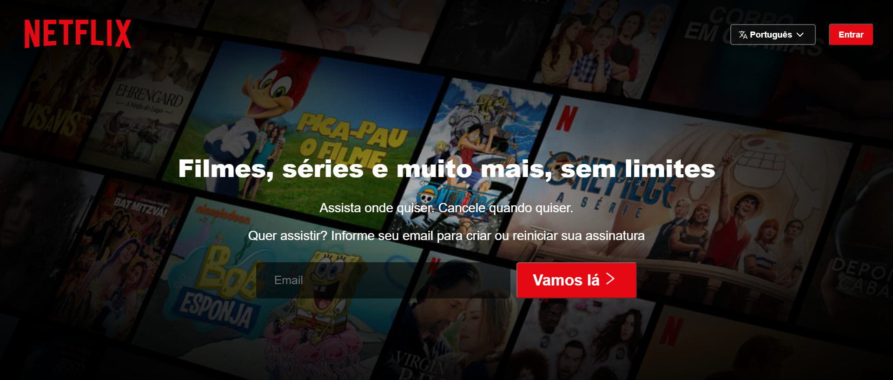
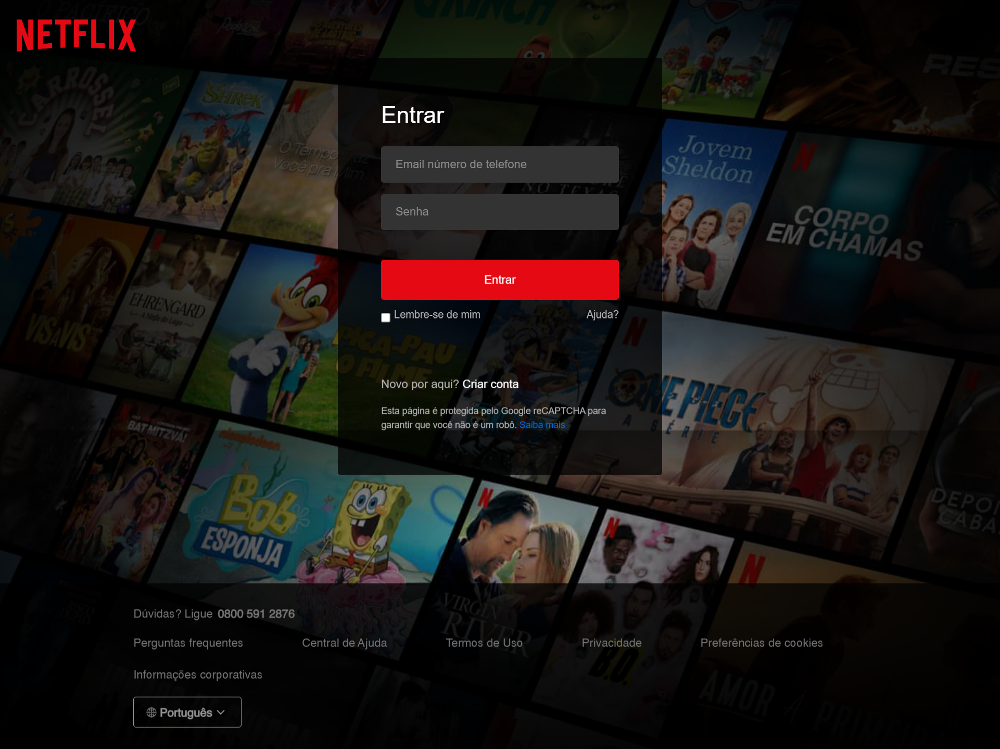
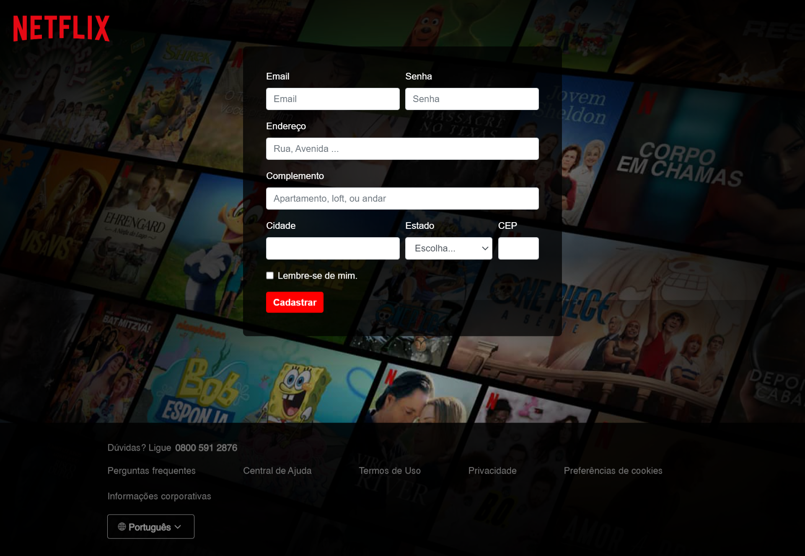

<h1 align="center"> Netflix Pages </h1>

Em caracter de estudo e aprimoramentos da máteria de frontEnd, elaborei um exemplo de algumas páginas do Site da Netflix.

  <a href="#🚀-tecnologias">Tecnologias</a>&nbsp;&nbsp;&nbsp;|&nbsp;&nbsp;&nbsp;
  <a href="#💻-projeto">Projeto</a>&nbsp;&nbsp;&nbsp;|&nbsp;&nbsp;&nbsp;
  <a href="#🔖-layout">Layout</a>&nbsp;&nbsp;&nbsp;|&nbsp;&nbsp;&nbsp;
  <a href="#memo-licença">Licença</a>

  

 

  
  
  

## 🚀 Tecnologias

Esse projeto foi desenvolvido com as seguintes tecnologias:

- HTML e CSS
- Git e Github
- Bootstrap

## 💻 Projeto

O Netflix é um pequeno projeto de aprimoramento em FrontEnd.

## 🔖 Layout

Você pode visualizar o layout do projeto através [DESSE LINK](https://www.jeffersonmoraesjunior.github.io/netflix-br).

## :memo: Licença

Esse projeto está sob a licença MIT.

---

Feito com ♥ by Jefferson Moraes!